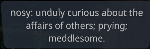
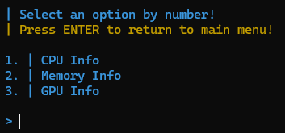
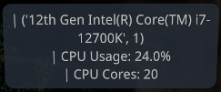
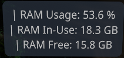
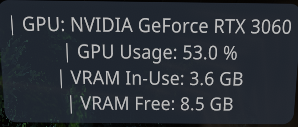
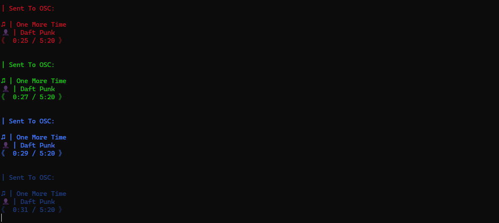
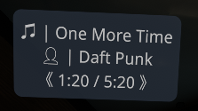
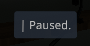
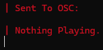
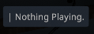

# | Kat's VRChat OSC Scripts!
:)

## | ChatboxOSC:
- Send a **custom message**!
- Send **random dictionary prompts and their definitions**! ( Because Funny )
- Send **hardware info** about **CPU, RAM, & GPU**!

### | Main Menu:

### | Custom Message:

### | Random Dictionary Definitions:
[**Definitions Source Here!**](https://www.dictionary.com)

### | Hardware Info:

## | iTunesOSC:
- Sends **current playing song & artist** aswell as an **elapsed time**.
- Sends a 'Paused.' message when paused & 'Nothing Playing.' when stopped!

### | Playing Music:

### | Music Paused:

### | Music Stopped:

## | Note:
**'Paused' & 'Stopped' are only
sent to OSC once per
occurence to allow the user
to pause playback and send
other things to OSC without
having to close the script!**

# | Final Note:
Please submit any **issues** you may experience or **suggestions** you may have!